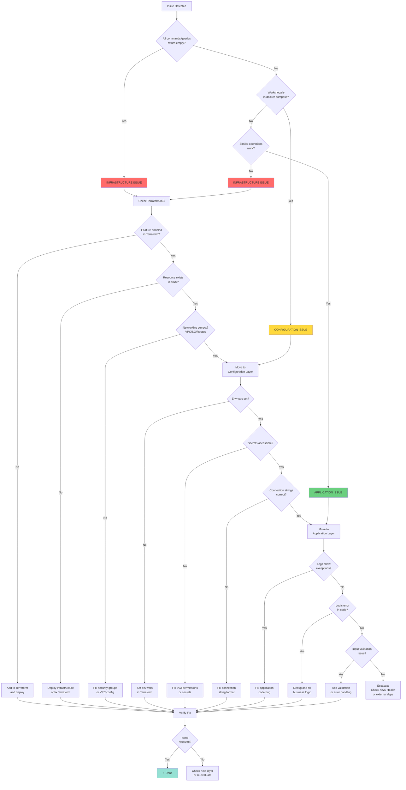
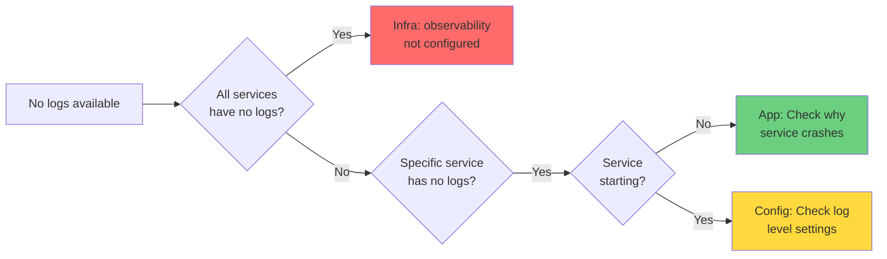
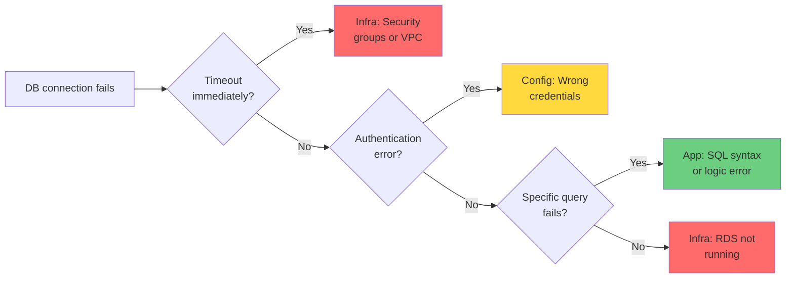
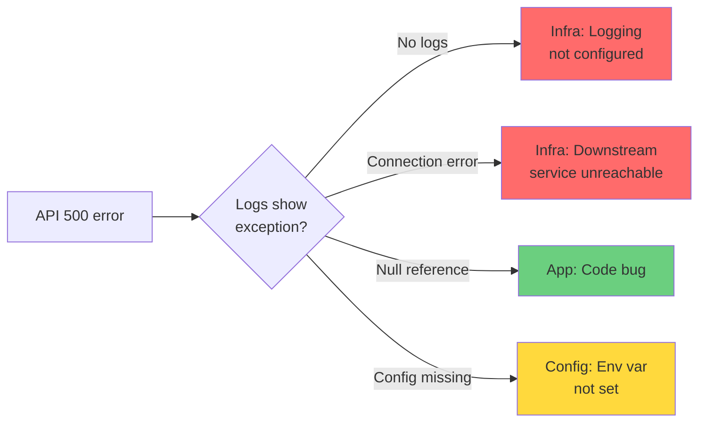
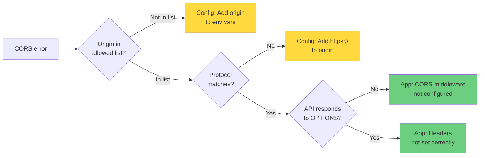

# Troubleshooting Flowchart

This visual guide helps you decide whether an issue is infrastructure, configuration, or application-related.

## Main Decision Tree

## Quick Reference Guide

### 1. Infrastructure Layer Issues (🔴 Red)

**Symptoms:**
- All queries/commands return empty
- Resource not found errors
- No logs/metrics anywhere
- Connection timeout immediately
- Works locally but not in cloud

**Where to Look:**
- `terraform/deploy/modules/*/main.tf`
- `terraform/setup/networking.tf`
- AWS Console resource status

**Common Fixes:**
- Add missing Terraform resource
- Enable feature in Terraform (e.g., observability)
- Fix security group rules
- Configure VPC connector
- Deploy infrastructure

### 2. Configuration Layer Issues (🟡 Yellow)

**Symptoms:**
- "Configuration not found" errors
- "Access denied" errors
- Inconsistent behavior across environments
- Works with hardcoded values
- Wrong service endpoints

**Where to Look:**
- `terraform/deploy/modules/app-runner/main.tf` (env vars section)
- AWS Secrets Manager
- IAM roles and policies
- Environment-specific tfvars

**Common Fixes:**
- Set missing environment variables
- Fix secret format (JSON vs plain string)
- Update IAM permissions
- Correct connection strings
- Fix service URLs

### 3. Application Layer Issues (🟢 Green)

**Symptoms:**
- Specific operations fail
- Business logic errors
- Data validation failures
- Exceptions in logs
- Incorrect calculations

**Where to Look:**
- Application logs in CloudWatch
- Controller/Service code
- Database queries
- Business logic

**Common Fixes:**
- Fix code bugs
- Add error handling
- Improve validation
- Fix business logic
- Update database queries

## Scenario-Based Flowcharts

### Scenario: No Logs Available

### Scenario: Database Connection Fails

### Scenario: API Returns 500 Error

### Scenario: CORS Error in Browser

## Red Flags Checklist

Before debugging, check for these red flags:

### 🚩 Infrastructure Red Flags
- [ ] ALL queries return empty (not just one)
- [ ] "Resource not found" from AWS
- [ ] No logs/metrics/traces anywhere
- [ ] Connection timeout < 5 seconds
- [ ] Works locally, fails in all cloud environments

**If any checked → Infrastructure issue**

### 🚩 Configuration Red Flags
- [ ] Works in one environment, fails in another
- [ ] "Access denied" or "Unauthorized"
- [ ] Works with hardcoded values
- [ ] Inconsistent behavior
- [ ] Wrong service endpoint errors

**If any checked → Configuration issue**

### 🚩 Application Red Flags
- [ ] Specific operation fails consistently
- [ ] Exception in logs
- [ ] Data validation error
- [ ] Business logic returns wrong result
- [ ] Works for some inputs, fails for others

**If any checked → Application issue**

## Debugging Time Estimates

To help prioritize and avoid over-investing time:

| Issue Type | Typical Resolution Time | Max Before Escalating |
|------------|-------------------------|----------------------|
| Infrastructure - Missing resource | 15-30 min (Terraform + deploy) | 1 hour |
| Infrastructure - Networking | 30-60 min (diagnose + fix) | 2 hours |
| Configuration - Env vars | 10-20 min (update + deploy) | 30 minutes |
| Configuration - Secrets | 20-40 min (fix format + permissions) | 1 hour |
| Application - Simple bug | 15-30 min (fix + test) | 1 hour |
| Application - Complex logic | 1-3 hours (debug + test + verify) | 4 hours |

**Rule:** If you exceed max time, stop and re-evaluate from Layer 1.

## Summary: The 3-Question Method

When debugging any issue, ask these 3 questions in order:

1. **Is the infrastructure deployed and configured correctly?**
   - Read Terraform
   - Verify in AWS Console
   - Check networking

2. **Is the configuration set correctly?**
   - Check env vars
   - Verify secrets
   - Validate connection strings

3. **Is the application code correct?**
   - Review logs
   - Debug code
   - Test logic

**Stop at the first "No" and fix that layer before proceeding.**

## Further Reading

- [Full Debugging Methodology](./debugging-methodology.md)
- [Terraform Debugging Guide](./terraform.md#debugging-terraform-managed-infrastructure)
- [.NET Cloud Debugging](./dotnet.md#debugging-net-applications-in-cloud)
- [React Debugging Guide](./react-typescript.md#debugging-frontend-issues)

